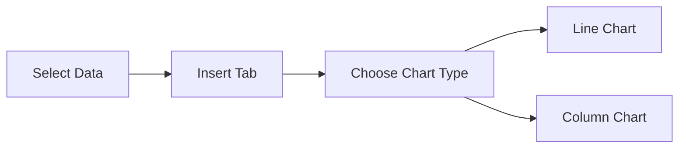
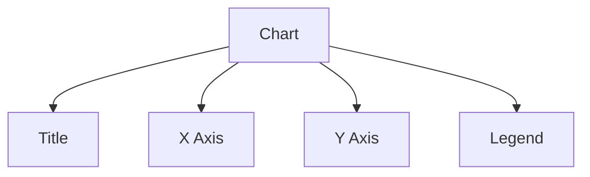
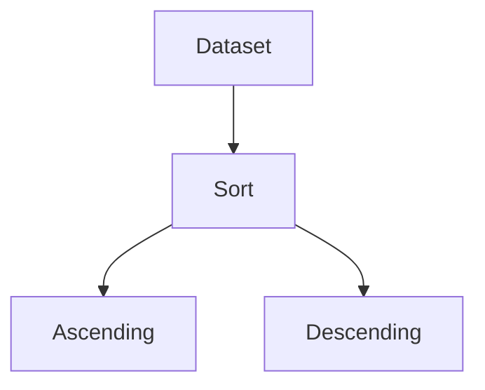

# Sales Data Analysis (2015–2020)

## Learning Outcomes
After completing this experiment, students will be able to:
- Enter and validate data in Excel
- Apply formulas (SUM, AVERAGE)
- Create and format charts (Line/Column)
- Export results to Word
- Perform Sorting and Advanced Filtering

---

## Dataset (As per Excel File)

| Year | Product | Region | Sales |
|------|--------|--------|-------|
| 2015 | A | South | 50000 |
| 2016 | A | South | 60000 |
| 2017 | A | South | 65000 |
| 2018 | A | South | 70000 |
| 2019 | A | South | 80000 |
| 2020 | A | South | 90000 |

### 📁 Download Excel File
[Download Sales Data Excel](sales_data_analysis.xlsx)

---

## Step 1: Data Entry & Formulas (Based on Excel File)

### Procedure
1. Open Microsoft Excel → New Workbook
2. Enter the dataset in columns A–D
3. In column D, enter Sales values
4. Leave column E for calculations

### Formulas (Already Embedded in Excel File)

| Cell | Description | Formula |
|------|------------|--------|
| E9 | Total Sales | =SUM(D2:D7) |
| E10 | Average Sales | =AVERAGE(D2:D7) |

### Labels in Excel
- D9 → "Total"
- D10 → "Average"

👉 This structure is already implemented in the provided Excel file

---

## Step 2: Chart Creation

### Procedure
1. Select range A1:D7
2. Insert → Charts
3. Choose:
   - Line Chart (Trend Analysis)
   - Column Chart (Comparison)

### Diagram: Chart Creation Flow

### Expected Output
- Sales increase steadily from 2015 to 2020

---

## Step 3: Chart Formatting

### Procedure
- Add Chart Title: *Sales Trend (2015–2020)*
- Add Axis Titles (Year, Sales)
- Add Legend
- Apply styles

### Diagram: Chart Elements

---

## Step 4: Export to Word

### Procedure
1. Copy Excel table → Paste in Word
2. Copy chart → Paste in Word

### Interpretation 
The sales data shows a consistent upward trend from 2015 to 2020. The increase in total and average sales indicates steady business growth.

---

## Step 5: Sorting

### Procedure
1. Select dataset (A1:D7)
2. Data → Sort
3. Apply:
   - Year → Ascending
   - Sales → Descending

### Diagram

---

## 🔍 Step 6: Advanced Filter

### Procedure
1. Create criteria range:

| Year |
|------|
| 2018 |

2. Go to Data → Advanced Filter
3. Select:
   - List Range → A1:D7
   - Criteria Range → Criteria Table
4. Apply filter

### Diagram

---

## Final Output
- Excel file with embedded formulas (E9, E10)
- Line/Column chart
- Word document with interpretation

---

## Conclusion
This experiment demonstrates how Excel tools can be used effectively for structured data analysis, visualization, and decision-making using real formulas embedded in the worksheet.

