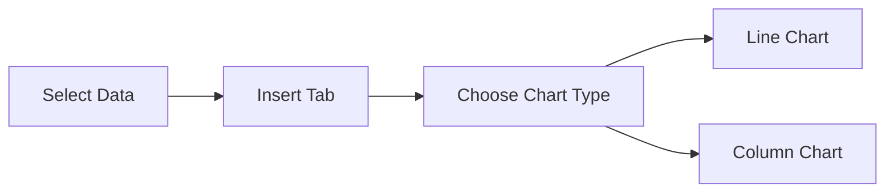
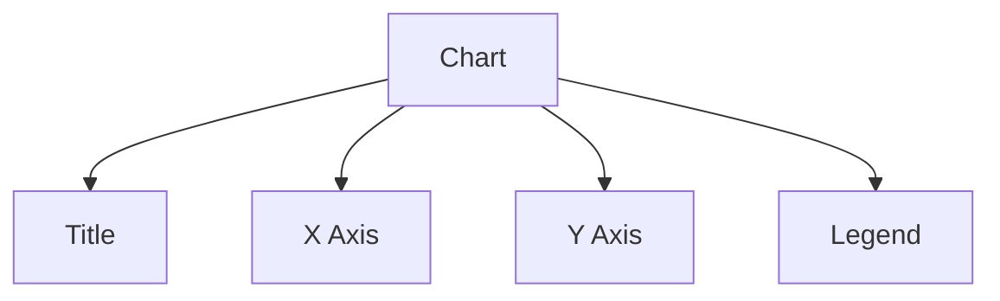
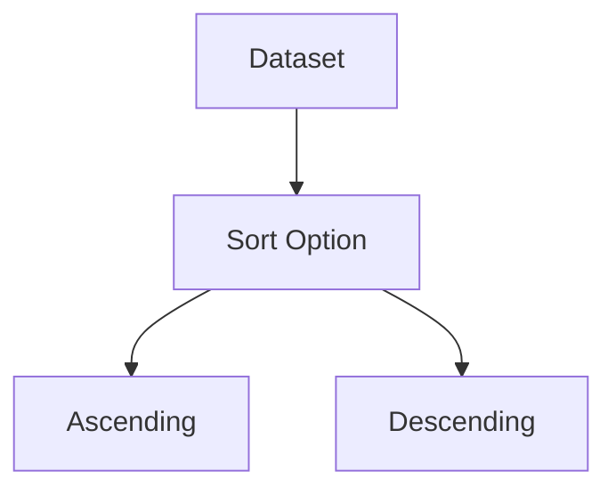
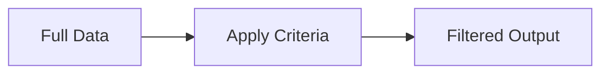

# Sales Data Analysis (2015–2020)

## 🎯 Learning Outcomes
After completing this experiment, students will be able to:
- Enter and validate data in Excel
- Apply formulas (SUM, AVERAGE)
- Create and format charts (Line/Column)
- Export results to Word
- Perform Sorting and Advanced Filtering

---

## 🧮 Dataset

| Year | Product | Region | Sales |
|------|--------|--------|-------|
| 2015 | A | South | 50000 |
| 2016 | A | South | 60000 |
| 2017 | A | South | 65000 |
| 2018 | A | South | 70000 |
| 2019 | A | South | 80000 |
| 2020 | A | South | 90000 |

### 📁 Download Excel File
[Download Sales Data Excel](sales_data_analysis.xlsx)

---

## 🧾 Step 1: Data Entry & Formulas 

### Procedure
1. Open Microsoft Excel → New Workbook
2. Enter the dataset in columns A–D
3. Save the file as *sales_data.xlsx*

### Formulas

| Calculation | Formula |
|------------|--------|
| Total Sales | =SUM(D2:D7) |
| Average Sales | =AVERAGE(D2:D7) |

### Output Cells
- Total → Cell E9
- Average → Cell E10

---

## 📊 Step 2: Chart Creation

### Procedure
1. Select range A1:D7
2. Insert → Charts
3. Choose:
   - Line Chart (Trend)
   - Column Chart (Comparison)

### Diagram: Chart Creation Flow

### Expected Output
- Trend increases from 2015 → 2020

---

## 🎨 Step 3: Chart Formatting 

### Procedure
- Add Chart Title: *Sales Trend (2015–2020)*
- Add Axis Titles
- Add Legend
- Apply Chart Styles

### Diagram: Chart Elements

---

## 📝 Step 4: Export to Word 

### Procedure
1. Copy table → Paste in Word
2. Copy chart → Paste in Word

### Interpretation (Model Answer)
Sales show a consistent upward trend from 2015 to 2020, indicating steady business growth and improved performance.

---

## 🔃 Step 5: Sorting

### Procedure
1. Select dataset
2. Data → Sort
3. Options:
   - Year (Ascending)
   - Sales (Descending)

### Diagram: Sorting Logic

---

## 🔍 Step 6: Advanced Filter

### Procedure
1. Create criteria range:

| Year |
|------|
| 2018 |

2. Data → Advanced Filter
3. Set List Range & Criteria Range
4. Apply filter

### Diagram: Filtering Process

---

## 📦 Final Output
- Excel file with formulas
- Chart (Line/Column)
- Word document with interpretation

---

## ✅ Conclusion
This experiment demonstrates how Excel tools can be used effectively for business data analysis, visualization, and decision-making.

