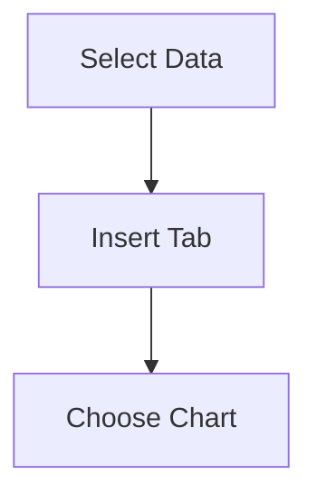

# Sales Data Analysis (2015–2020)

## Learning Outcomes
- Analyse multi-region sales data
- Apply SUM, AVERAGE, and Growth formulas
- Create charts for comparison and trends
- Perform sorting and filtering

---

## Dataset 

| Region | Year | Sales |
|--------|------|-------|
| North | 2015 | 42000 |
| North | 2016 | 46800 |
| North | 2017 | 51200 |
| North | 2018 | 55600 |
| North | 2019 | 60100 |
| North | 2020 | 65400 |
| South | 2015 | 35000 |
| South | 2016 | 38500 |
| South | 2017 | 41200 |
| South | 2018 | 44800 |
| South | 2019 | 48500 |
| South | 2020 | 53200 |
| East  | 2015 | 28000 |
| East  | 2016 | 31200 |
| East  | 2017 | 35600 |
| East  | 2018 | 39400 |
| East  | 2019 | 43800 |
| East  | 2020 | 49100 |
| West  | 2015 | 32000 |
| West  | 2016 | 35800 |
| West  | 2017 | 40100 |
| West  | 2018 | 44200 |
| West  | 2019 | 49600 |
| West  | 2020 | 55300 |

### 📁 Download Excel File
[Download Sales Data Excel](sales_data_analysis.xlsx)

---

## Step 1: Data Entry & Formulas

### Structure in Excel

| Column | Description |
|--------|------------|
| A | Region |
| B–G | Sales (2015–2020) |
| H | Total |
| I | Average |
| J | Growth % |

### Formulas Used

| Calculation | Formula |
|------------|--------|
| Total | =SUM(B4:G4) |
| Average | =AVERAGE(B4:G4) |
| Growth % | =(G4-B4)/B4 |

### Grand Total Row

| Calculation | Formula |
|------------|--------|
| Year-wise Total | =SUM(B4:B7) |
| Overall Total | =SUM(H4:H7) |
| Avg of Avg | =AVERAGE(I4:I7) |

---

## Step 2: Chart Creation

### Recommended Charts
- Line Chart → Trend over years
- Column Chart → Region comparison

### Diagram 

### Insight
- North region has highest sales
- All regions show upward growth trend

---

## Step 3: Chart Formatting

- Title: *Regional Sales Trend (2015–2020)*
- X-axis: Year
- Y-axis: Sales
- Legend: Regions

---

## Step 4: Interpretation

Sales across all regions show steady growth. North region leads consistently, while East shows gradual improvement. Overall performance indicates positive business expansion.

---

## Step 5: Sorting

### Example
- Sort by 2020 Sales → Identify top region
- Sort by Growth % → Identify fastest growing region

---

## Step 6: Advanced Filter

### Example Criteria

| Region |
|--------|
| North |

OR

| Growth % |
|----------|
| >0.5 |

---

## Final Output
- Multi-region Excel analysis
- Charts showing trends and comparison
- Summary interpretation

---

## Conclusion
This experiment demonstrates how Excel tools can be used effectively for business data analysis, visualization, and decision-making.

