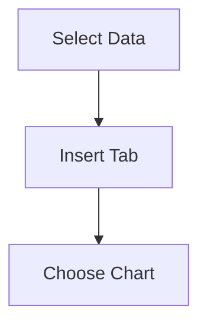

# Financial Data Analysis & Reporting

*Learning Outcomes*

- Analyse company financial performance
- Apply ranking, logical, and statistical formulas
- Perform filtering and risk analysis
- Interpret financial indicators for decision-making

---

## Dataset 

| Company | Revenue (Cr) | Profit (Cr) | EPS (Rs) | ROE (%) | Debt/Equity |
|---------|-------------|-------------|----------|---------|-------------|
| Reliance Industries | 845000 | 75000 | 110 | 18 | 0.8 |
| Tata Steel | 150500 | 12800 | 42 | 14 | 1.2 |
| HDFC Bank | 160000 | 35000 | 60 | 20 | 0.5 |
| Infosys | 150000 | 32000 | 55 | 23 | 0.3 |
| ITC | 58500 | 15200 | 39 | 18 | 0.4 |

*📁 Download Excel File*  
[Download Financial Data Excel](financial_data_analysis.xlsx)

---

## Step 1: Data Entry & Formulas

### Additional Columns in Excel

| Column | Purpose | Formula |
|--------|--------|--------|
| Rank by Profit | Profit ranking | =RANK(C4,C$4:C$8,0) |
| Rank by ROE | ROE ranking | =RANK(E4,E$4:E$8,0) |
| Risk Level | Categorisation | =IF(F4>1,"High Risk",IF(F4>0.6,"Medium","Low Risk")) |
| Filter Result | Condition check | =IF(AND(E4>0.15,F4<1),"Qualifies","Excluded") |

---

## Step 2: Chart Creation

### Recommended Charts
- Column Chart → Compare Profit & Revenue
- Bar Chart → Compare ROE across companies

### Insight
- Reliance has highest revenue and profit
- Infosys has highest ROE

---

## Step 3: Chart Formatting

- Title: *Company Financial Comparison*
- X-axis: Company
- Y-axis: Values
- Legend: Metrics

---

## Step 4: Interpretation

Reliance Industries dominates in revenue and profit. Infosys shows strong efficiency with highest ROE. Tata Steel has higher financial risk due to high debt-equity ratio.

---

## Step 5: Sorting

### Example
- Sort by Profit → Identify top company
- Sort by ROE → Identify best performing company

---

## Step 6: Advanced Filter

### Criteria

| ROE (%) | Debt/Equity |
|---------|------------|
| >15 | <1 |

### Output
- Reliance Industries
- HDFC Bank
- Infosys
- ITC

---

## Step 7: Conditional Formatting

- Highlight Debt/Equity > 1 → Tata Steel (High Risk)

---

## Step 8: Summary Statistics

| Metric | Formula |
|-------|--------|
| Highest Revenue | =MAX(B4:B8) |
| Highest Profit | =MAX(C4:C8) |
| Best EPS | =MAX(D4:D8) |
| Avg ROE | =AVERAGE(E4:E8) |
| Lowest D/E | =MIN(F4:F8) |
| Companies ROE>15% | =COUNTIF(E4:E8,">0.15") |

---

## Final Output
- Financial dataset with rankings
- Risk classification
- Filtered company list
- Summary insights

---

## Conclusion
This experiment demonstrates advanced Excel techniques for financial analysis including ranking, logical evaluation, and performance comparison.

